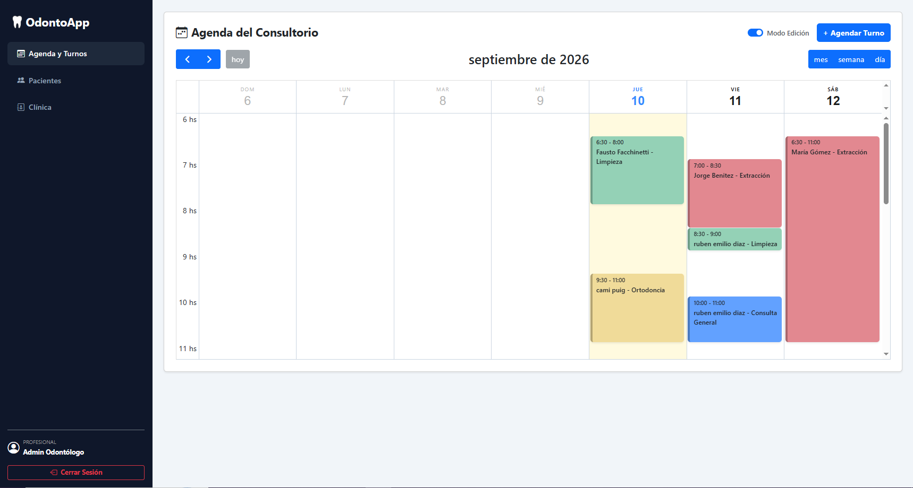
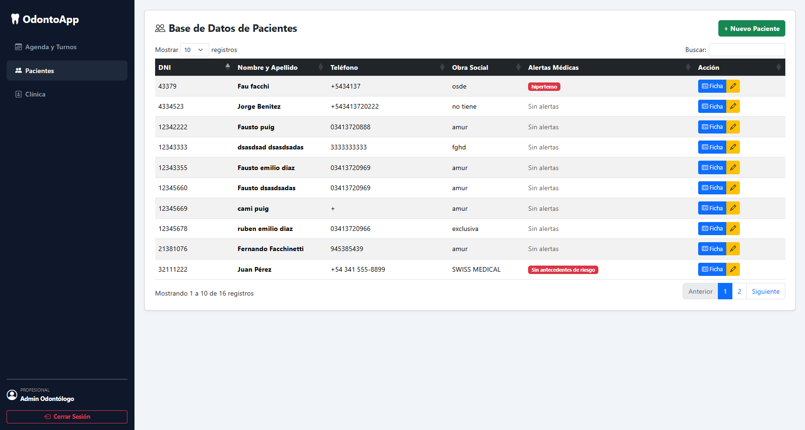
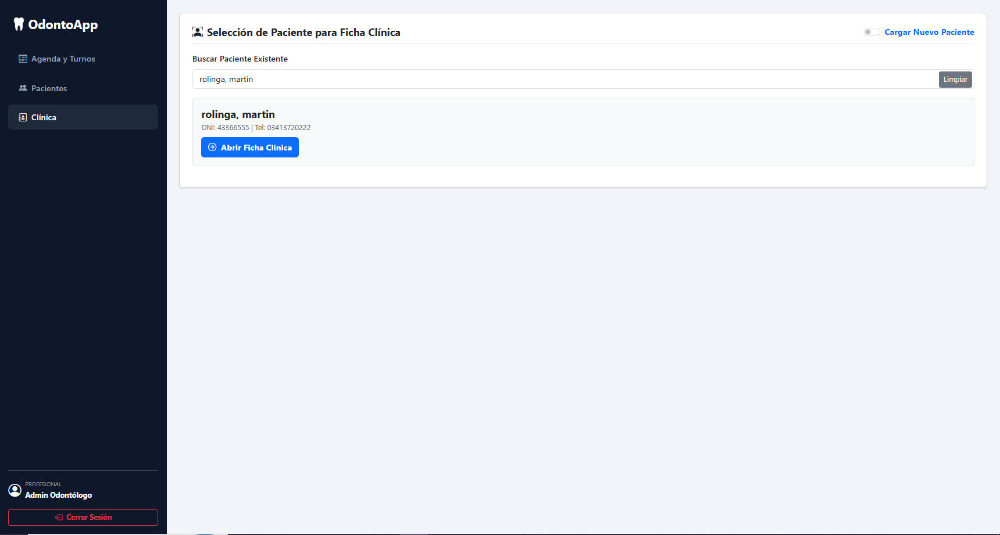
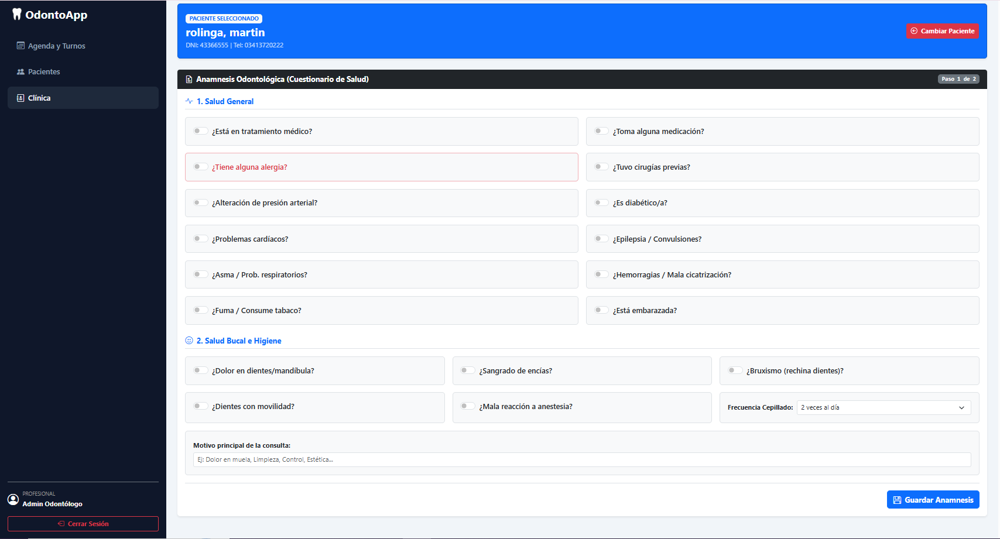

# 🦷 OdontoApp - Sistema de Gestión Odontológica

Sistema web desarrollado para la administración integral de consultorios odontológicos, optimizando el manejo de turnos, historiales médicos y la gestión de pacientes.

## 🚀 Tecnologías
- **PHP** y **JavaScript**
- **HTML5** y **CSS3**
- **MySQL** (Base de datos relacional)

---

## 📸 Capturas de Pantalla

### 📅 Módulo de Agenda
| Vista Principal | Nuevo Turno |
| :---: | :---: |
|  |  |

### Módulo de Pacientes
| Pacientes | Editar Paciente |
| :---: | :---: |
|  |  |

### Módulo de Clínica (Anamnesis y Fichas)
| Vista 1 | Vista 2 |
| :---: | :---: |
|  |  |

| Vista 3 | Vista 4 |
| :---: | :---: |
|  |  |

---

## ⚙️ Base de Datos
El proyecto incluye el archivo `odonto_app.sql` con la estructura necesaria para importar y poner en marcha la base de datos localmente mediante phpMyAdmin.
